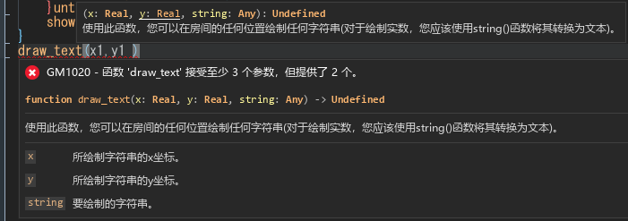
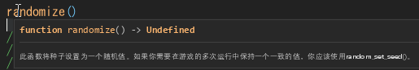
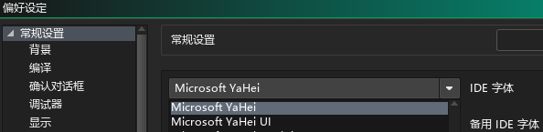

# GameMaker 函数提示中文翻译
这翻译了GM的函数提示，即GM的语法规范文件(GmlSpec.xml)。

（语法诊断在IDE翻译中）

翻译工具：OmegaT

LLM插件：[自定义LLM翻译插件(OmegaT openai api translate plugin))](https://github.com/MagicShiba/omegat-plugin-openai-api-translate)

IDE翻译：[GM IDE 中文翻译](https://github.com/MagicShiba/GameMakerIDECNTranslation)

## 使用方法

运行"应用翻译.bat"文件，选择月份版或是Beta版，自动复制到对应位置。但这只会应用于最新版。

如果你有多运行时，需要安装到特定的旧版，则需要复制 target目录下 GmlSpec.xml 到 对应的 runtime 文件内。

## 显示问题
如果你遇到字体太小的情况，请尝试修改ide字体。

注意目前你基本不能修改IDE备用字体，因为需要字体家族，如果选择的字体覆盖不够广会导致崩溃。

文本太长会被截断，这是羽毛换行bug，以前能正常显示。

